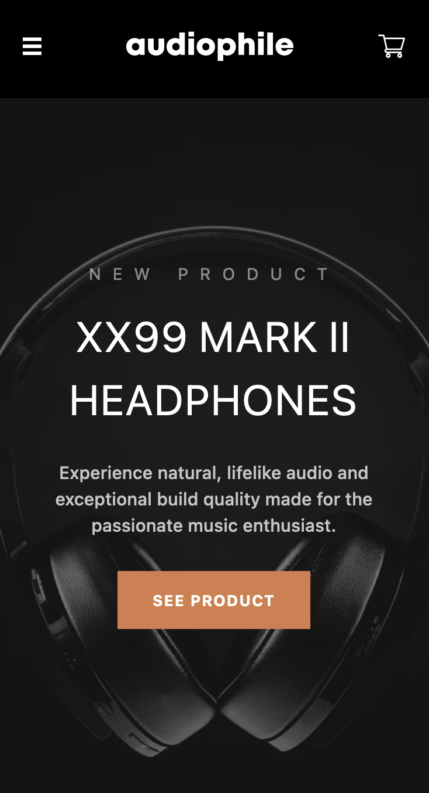

# Frontend Mentor - Audiophile e-commerce website solution

This is a solution to the [Audiophile e-commerce website challenge on Frontend Mentor](https://www.frontendmentor.io/challenges/audiophile-ecommerce-website-C8cuSd_wx). Frontend Mentor challenges help you improve your coding skills by building realistic projects.

## Overview

### Screenshot

### Links

-   Frontend URL: [GitHub](https://github.com/jakegodsall/fm-audiophile-ecommerce-frontend)
-   Backend URL: [GitHub](https://github.com/jakegodsall/fm-audiophile-ecommerce-backend)
-   Live Site URL: [Netlify](https://jakegodsall-audiophile-ecommerce.netlify.app/)

## My process

### Built with

-   [React](https://reactjs.org/) - JS library
-   [Next.js](https://nextjs.org/) - React library
-   [TailwindCSS](https://tailwindcss.com/) - Utility-first CSS framework
-   [Framer Motion](https://www.framer.com/motion/) - Animation library

### Continued development

I am actively working on expanding this project. The next phase involves building a REST API using Spring MVC. With the integration of this API, the aim is to convert this frontend-centric project into a full-stack web application, providing a comprehensive E-commerce solution.

## Author

-   Website - [Jake Godsall](https://jakegodsall.com)
-   Frontend Mentor - [@jakegodsall](https://www.frontendmentor.io/profile/jakegodsall)
-   LinkedIn - [@godsalljake](https://www.linkedin.com/in/godsalljake/)
